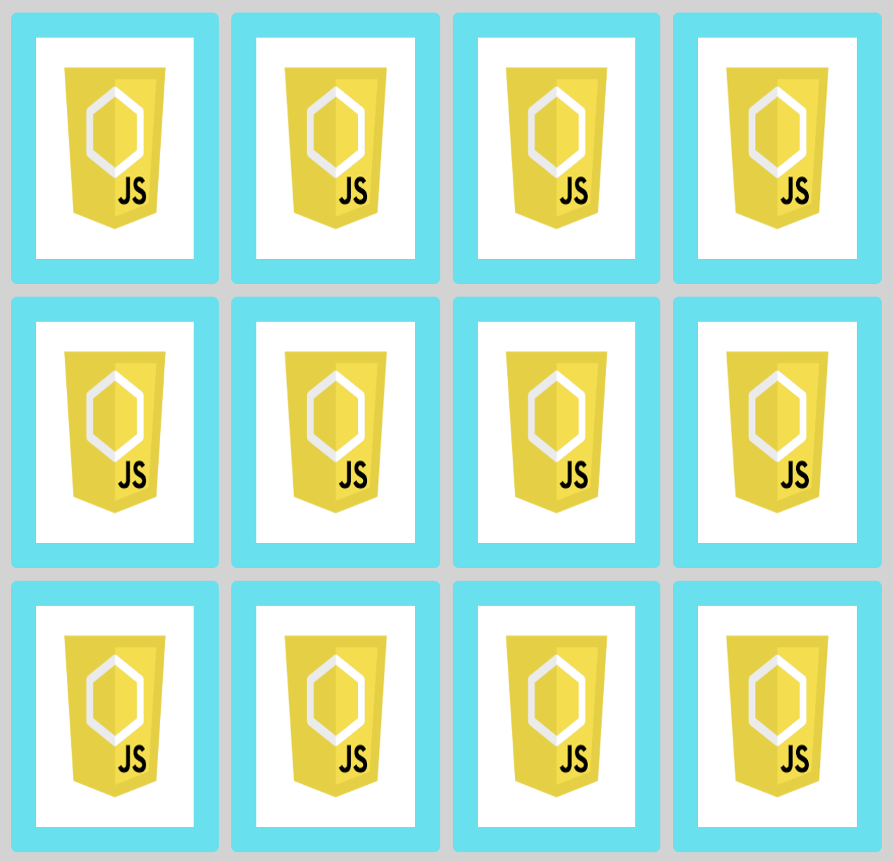

<h1 style="color:#ff0000">Игра на запоминание</h1>

<strong>Описание</strong>:  
Игра для тех, кто хочет потренировать память и любит собак. В этой игре нужно запоминать изображения на карточках. Вы переворачиваете карточку, кликнув по ней, чтобы увидеть изображение. Далее, среди других карточек вам нужно отыскать ту, у которой такое же изображение.  

<strong>Возможности</strong>:  
— На экране отображается игровое поле. Изначально все карточки представлены «рубашкой» кверху. 
— Есть кнопка для старта игры, после нажатия через API рандомно загружаются фотокарточки собак. 
— Пользователь может нажать на любую карточку, чтобы увидеть скрытое изображение. Изображение остаётся видимым пока пользователь не нажмёт на другую карточку.

<strong>Используемые технологии</strong>:  
— HTML 
— CSS 
— JavaScript 
— Express.js 
— Node.js 

  
  
  
  <iframe src='//gifs.com/embed/game-concentration-jZo65Y' frameborder='0' scrolling='no' width='382px' height='360px' style='-webkit-backface-visibility: hidden;-webkit-transform: scale(1);' ></iframe>

